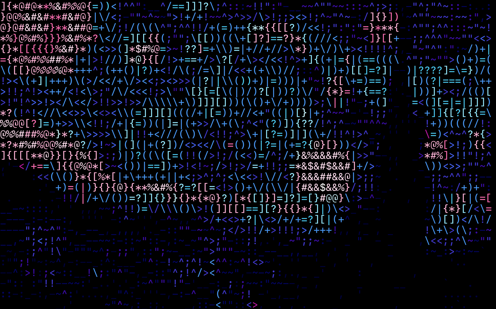
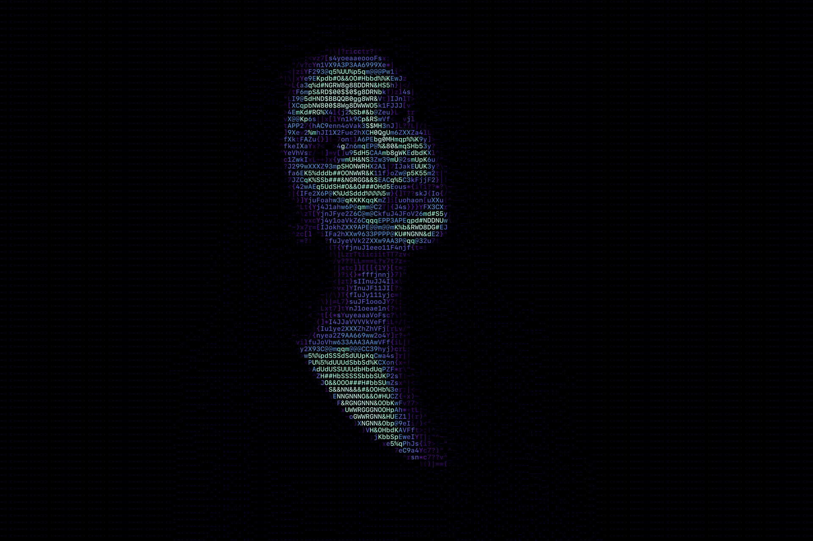
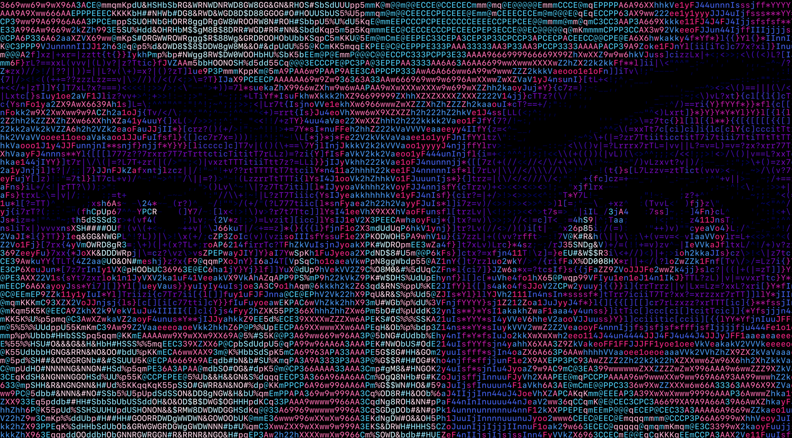

# ASCIICSA: ACSII Computer Synthesized Art

<!-- ABOUT THE PROJECT -->
## About

There are many image to ASCII converters avaliable but these projects were limited and lacked the customization capabilities needed to create artistics images. 
**ASCIICSA** - ***ACSII Computer Synthesized Art*** - can generate highly customizable ASCII art from an input image or video. Take a look at some of the results and even try it out to create your own ASCII art! 


### Customization Features:
* Color Selection
  * Select number of shades of Greyscale
  * Select standard 8 or 16 ANSII colors for a retro look 
  * Automatically sample colors from source image
* Text
  * Select the font used by uploading font bitmap
  * Choose characters used 
* Conversion
  * Add filters to get desired output
  * Set sampling methods used
  * Set size and resolution of output image
  * Save raw ANSI text to textfile

<!-- GETTING STARTED -->
## Getting Started

This is an example of how you may give instructions on setting up your project locally.
To get a local copy up and running follow these simple example steps.

### Installation
1. Clone the repo
   ```sh
   git clone https://github.com/ArianOmidi/ASCIICSA.git
   ```
2. Ensure `python>=3.9`
   ```sh
   python --version
   ```
3. Install project dependencies
   ```sh
   pip install -r requirements.txt
   ```

<!-- USAGE EXAMPLES -->
## Usage

### Convert an image to ASCII image
```sh
  python src/ascii.py /path/to/image
```


### Convert an image to ASCII video
```sh
  python src/ascii_video.py /path/to/video
```


### Convert an image to animated ASCII image
```sh
  python src/ascii_animation.py /path/to/image
```


### Image Customization Parameters
```
MISC:
  -h, --help            show this help message and exit
  
COLOR SELECTION:
  -g, --greyscale       Select for greyscale image and pass number of shades used (defaults to true and 8 shades).
  -gs GREYSCALESAMPLES, --greyscaleSamples GREYSCALESAMPLES
                        Number of samples in palette when in greyscale mode (defalut: 8).
  -c [{ansi8,ansi16,rgb,rb,gb,b}], --colorPalatte [{ansi8,ansi16,rgb,rb,gb,b}]
                        Select color palatte used to for colored image (default: ansi16).
  -C {nearest,fixed}, --colorSelection {nearest,fixed}
                        The color selection method used: [nearest, fixed] (default: nearest).
  -a [AUTOCOLOR], --autoColor [AUTOCOLOR]
                        Size of sampled color palette from the most prominent colors in the picture (defalut: 16).
  -i, --invert          Invert the output of the image (default: light characters on black background).
  
ASCII SAMPLING:
  -n COLS, --cols COLS  The number of characters on the width of the output image (default: 120).
  -l SCALE, --scale SCALE
                        The width-to-height ratio of the pixels sampled for each character (default: 0.6).
  -t CHARS, --chars CHARS
                        The ASCII characters to be used or select from presets: [printable, alphanumeric, alpha,
                        numeric, lower, upper, tech, symbols] (default: printable)
  -f CONSTRASTFACTOR, --constrastFactor CONSTRASTFACTOR
                        Contrast factor: <1 less contrast, 1 no change, >1 more contrast (default: 1.3).
  -T {resize,median,mean}, --sampling {resize,median,mean}
                        The sampling method used: [resize, median, mean] (default: resize).
  -F FONTPATH, --fontPath FONTPATH
                        The path to the font to be used (default: SFMono-Medium).

OUTPUT:
  -r RESOLUTION, --resolution RESOLUTION
                        The resolution of the output image (default: 1920)
  -S [SAVE], --save [SAVE]
                        Save ASCII image as inputed path (default: './out/<filename>_ascii.png').
  -O OUTFILE, --out OUTFILE
                        Output text location.
  -H, --hide            Do not open image after conversion (default: false).
  -P, --print           Print ASCII text to output (default: false).
```
### Video Customization Parameters
```
MISC:
  -h, --help            show this help message and exit
  
COLOR SELECTION:
  -g [GREYSCALESCHEME], --greyscale [GREYSCALESCHEME]
                        Select for greyscale image and specify number of shades (defaults to 8 when selected).
  -a [AUTOCOLOR], --autoColor [AUTOCOLOR]
                        Size of sampled color palette from the most prominent colors in the picture (defalut: 16).
  -R [COLORSAMPLERATE], --colorSampleRate [COLORSAMPLERATE]
                        When autocolor is selected, number of frames between color sampling (defaults to 1)
  -i, --invert          Invert the output of the image (default: light characters on black background).
  
ASCII SAMPLING:
  -n COLS, --cols COLS  The number of characters on the width of the output image (default: 120).
  -l SCALE, --scale SCALE
                        The width-to-height ratio of the pixels sampled for each character (default: 0.6).
  -t CHARS, --chars CHARS
                        The ASCII characters to be used or select from presets: [printable, alphanumeric, alpha,
                        numeric, lower, upper, tech, symbols] (default: printable)

OUTPUT:
  -r FPS, --fps FPS     The fps of output video. (default: match input video)
  -r RESOLUTION, --resolution RESOLUTION
                        The resolution of the output image (default: 1920)
  -O OUTFILE, --out OUTFILE
                        Output text location.
  -H, --hide            Do not open image after conversion (default: false).
  -T, --test            Test settings before video generation (default: false).
```

## Examples

```sh
python3 src/ascii.py -a 16 stary_night.jpg # auto color
```


```sh
python3 src/ascii.py -n 80 -c rb -t symbols stary_night.jpg   # something funky
```


```sh
python3 src/ascii.py -c b woman.jpg    # blue colour palatte
```


```sh
python3 src/ascii.py -c rb bill-evans.jpg    # red-blue colour palatte
```


```sh
python3 src/ascii.py -n 160 woman.jpg    # more characters
```


***For more examples see the `./resources/` folder.***

<!-- LICENSE -->
## License

Distributed under the MIT License. See `LICENSE` for more information.


<!-- CONTACT -->
## Contact

Arian Omidi - arian.omidi@icloud.com

***Any ideas or improvements are much appreciated.***
