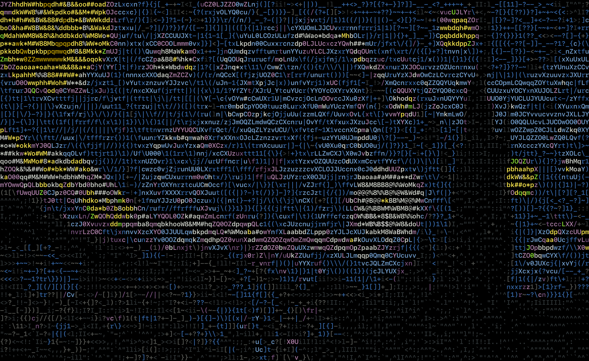

# ASCIICSA

<!-- TABLE OF CONTENTS -->
<details open="open">
  <summary>Table of Contents</summary>
  <ol>
    <li>
      <a href="#about-the-project">About The Project</a>
      <ul>
        <li><a href="#built-with">Built With</a></li>
      </ul>
    </li>
    <li>
      <a href="#getting-started">Getting Started</a>
      <ul>
        <li><a href="#prerequisites">Prerequisites</a></li>
        <li><a href="#installation">Installation</a></li>
      </ul>
    </li>
    <li><a href="#usage">Usage</a></li>
    <li><a href="#roadmap">Roadmap</a></li>
    <li><a href="#contributing">Contributing</a></li>
    <li><a href="#license">License</a></li>
    <li><a href="#contact">Contact</a></li>
    <li><a href="#acknowledgements">Acknowledgements</a></li>
  </ol>
</details>


<!-- ABOUT THE PROJECT -->
## About

There are many image to ASCII converters avaliable but these projects were limited and lacked the customization capabilities needed to create artistics images. 
Try it out and create custom ASCII images and even videos! 

[![ASCIICSA][product-screenshot]](https://example.com)

### Customization Features:
* Color Selection
  * Select number of shades of Greyscale
  * Select standard 8 or 16 ANSII colors for a retro look 
  * Automatically sample colors from source image
* Text
  * Select the font used by uploading font bitmap
  * Choose characters used 
* Filter
  * Add filters to get desired output
  * 

<!-- GETTING STARTED -->
## Getting Started

This is an example of how you may give instructions on setting up your project locally.
To get a local copy up and running follow these simple example steps.

### Installation

1. Clone the repo
   ```sh
   git clone https://github.com/your_username_/Project-Name.git
   ```
2. Install project dependencies
   ```sh
   pip install -r requirements.txt
   ```

<!-- USAGE EXAMPLES -->
## Usage

### Convert an image to ASCII image
```sh
  python ascii.py /path/to/image
```
  
### Convert an image to animated ASCII image
```sh
  python ascii_animation.py /path/to/image
```

### Convert an image to ASCII video
```sh
  python ascii_video.py /path/to/video
```

### Customization Parameters
```
Optional Arguments:

  -g [GREYSCALESCHEME], --greyscale [GREYSCALESCHEME]
                        Select for greyscale image and pass number of shades used (defaults to true and 8 shades).
  -c [COLORSCHEME], --color [COLORSCHEME]
                        Select for colored image, use with --autoColor for best results (defaults to ANSI16 colors).
  -a, --autoColor       Sample color pallet from most prominent colors in the picture (defalut: 8 samples for grescale and 16 samples for color).
  -n COLS, --cols COLS  The number of characters on the width of the output image (default: 120).
  -l SCALE, --scale SCALE
                        The width-to-height ratio of the pixels sampled for each character (default: 0.6).
  -F FONTPATH, --fontPath FONTPATH
                        The path to the font to be used (default: SFMono-Medium).
  -t CHARS, --chars CHARS
                        The ASCII characters to be used or select from presets: [printable, alphanumeric, alpha, numeric, lower, upper, tech, symbols]
                        (default: printable)
  -i, --invert          Invert the output of the image (default: light characters on black background).
  -r RESOLUTION, --resolution RESOLUTION
                        The resolution of the output image (default: 1920)
  -f CONSTRASTFACTOR, --constrastFactor CONSTRASTFACTOR
                        Contrast factor: <1 less contrast, 1 no change, >1 more contrast (default: 1.3).
  -T {resize,median,mean}, --sampling {resize,median,mean}
                        The sampling method used: [resize, median, mean] (default: resize).
  -C {nearest,fixed}, --colorSelection {nearest,fixed}
                        The color selection method used: [nearest, fixed] (default: nearest).
  -o OUTFILE, --out OUTFILE
                        Output text location.
  -O IMGOUTFILE, --imgout IMGOUTFILE
                        Output image location.
  -H, --hide            Do not open image after conversion (default: false).
  -s, --save            Save ASCII image (default: false).
  -p, --print           Print ASCII text to output (default: false).
```

## Examples

```
python3 ascii.py -c stary_night.jpg
```


<!-- LICENSE -->
## License

Distributed under the MIT License. See `LICENSE` for more information.


<!-- CONTACT -->
## Contact

Arian Omidi - arian.omidi.6@gmail.com

Project Link: [https://github.com/ArianOmidi/ASCIICSA](https://github.com/ArianOmidi/ASCIICSA)


<!-- ACKNOWLEDGEMENTS -->
## Acknowledgements
* [GitHub Emoji Cheat Sheet](https://www.webpagefx.com/tools/emoji-cheat-sheet)


<!-- MARKDOWN LINKS & IMAGES -->
<!-- https://www.markdownguide.org/basic-syntax/#reference-style-links -->
[product-screenshot]: resources/images/zebra_converted.png
[klimt]: resources/images/klimt_ansi16.png
